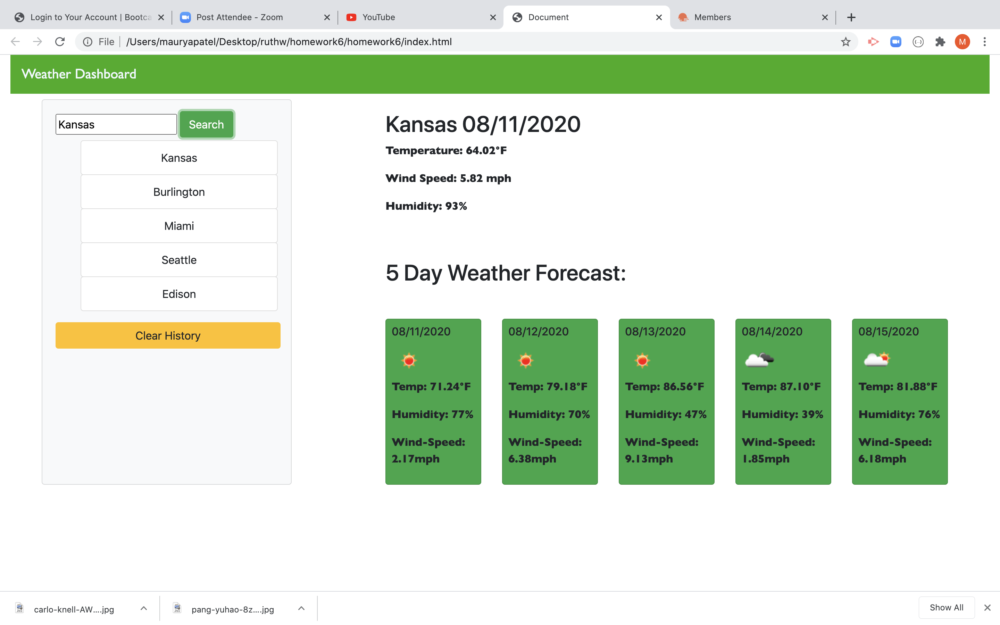

# Weather Dashboard

# Deployed Link
https://maurya512.github.io/homework6/

# User Story

AS A traveler
I WANT to see the weather outlook for multiple cities
SO THAT I can plan a trip accordingly

# For this homework we used HTML, CSS, JS, jQuery and a Third Party API key along with moment.js . 

# index.html

 In this index file we created a basic oultet of how the weather dashboard would look. Made use of bootstrap's navbar, containers, rows, forms and cards. 

# script.js

 In this file we worked on the logic behind the weather dashboard. 
We grabbed an api key to get weather data for various cities. 
Created functions that display weather for current city at current time, display's the history of cities once more than 1 city is entered while ensuring that the same city isn't displayed twice, a function that displays the weather data for 5 upcoming days and lastly a function to clear the history of all the cities the user has entered.  

api key used in this program -> e2f589323ac21fe7c4597c290fc12523 

# style.css

 In this file we worked on the style elements of the dashboard. 

# screenshot of the weather dashboard

